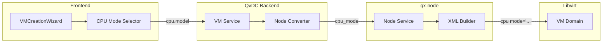

# CPU Mode User Selection in VM Creation Wizard

## Overview

Add a CPU configuration selector to the VM creation wizard that lets users choose between performance-optimized and flexibility-optimized CPU modes, using user-friendly names and clear explanations.

## User-Facing Names


| Internal Name      | User-Friendly Name      | Description                                     |
| ------------------ | ----------------------- | ----------------------------------------------- |
| `host-passthrough` | **Quantix Performance** | Maximum performance, single-host workloads      |
| `host-model`       | **Quantix Flexible**    | Cluster-ready, supports migration and snapshots |


## Architecture




## Changes Required

### 1. Proto: Add CPU Mode to Node Daemon Spec

**File:** [proto/limiquantix/node/v1/node_daemon.proto](proto/limiquantix/node/v1/node_daemon.proto)

Add `cpu_mode` field to `VMSpec` message (around line 296):

```protobuf
message VMSpec {
  uint32 cpu_cores = 1;
  uint32 cpu_sockets = 2;
  uint32 cpu_threads_per_core = 3;
  string cpu_mode = 14;  // NEW: "host-passthrough", "host-model", etc.
  // ... existing fields ...
}
```

### 2. QvDC Backend: Pass CPU Mode to Node

**File:** [backend/internal/services/vm/service.go](backend/internal/services/vm/service.go)

In `convertToNodeDaemonCreateRequest()` (around line 1712), add:

```go
Spec: &nodev1.VMSpec{
    CpuCores:          spec.GetCpu().GetCores(),
    CpuSockets:        spec.GetCpu().GetSockets(),
    CpuThreadsPerCore: spec.GetCpu().GetThreadsPerCore(),
    CpuMode:           spec.GetCpu().GetModel(),  // NEW: Pass CPU mode
    // ... existing fields ...
}
```

### 3. qx-node: Apply CPU Mode from Spec

**File:** [agent/limiquantix-node/src/service.rs](agent/limiquantix-node/src/service.rs)

In VM creation (around line 1320), apply CPU mode:

```rust
// Set CPU mode from spec, default to "host-model" for cluster compatibility
if !spec.cpu_mode.is_empty() {
    config.cpu.model = Some(spec.cpu_mode.clone());
} else {
    config.cpu.model = Some("host-model".to_string());  // New default
}
```

### 4. Hypervisor: Change Default CPU Mode

**File:** [agent/limiquantix-hypervisor/src/xml.rs](agent/limiquantix-hypervisor/src/xml.rs)

Change default from `host-passthrough` to `host-model` (line 185):

```rust
let mode = self.config.cpu.model.as_deref().unwrap_or("host-model");
```

### 5. Hypervisor: Update Snapshot Logic

**File:** [agent/limiquantix-hypervisor/src/libvirt/backend.rs](agent/limiquantix-hypervisor/src/libvirt/backend.rs)

Update snapshot logic to allow memory snapshots for `host-model` (around line 564):

- Detect CPU mode from VM XML
- Only block memory snapshots for `host-passthrough`
- Allow memory snapshots for `host-model`

### 6. Frontend: Add CPU Mode Selector to Wizard

**File:** [frontend/src/components/vm/VMCreationWizard.tsx](frontend/src/components/vm/VMCreationWizard.tsx)

Add to Hardware step (Step 5):

**a) Add to form data interface:**

```typescript
interface VMCreationData {
  // ... existing fields ...
  cpuMode: 'host-model' | 'host-passthrough';  // NEW
}
```

**b) Add default value:**

```typescript
cpuMode: 'host-model',  // Default to flexible for cluster compatibility
```

**c) Add UI selector with cards:**

- Two selectable cards with icons
- "Quantix Flexible" (recommended, default)
- "Quantix Performance"
- Each card shows pros/cons

**d) Update API submission:**

```typescript
spec: {
  cpu: {
    cores: formData.cpuCores * formData.cpuSockets,
    sockets: formData.cpuSockets,
    model: formData.cpuMode,  // NEW
  },
}
```

### 7. Guest OS Profiles: Update Defaults

**File:** [agent/limiquantix-hypervisor/src/guest_os.rs](agent/limiquantix-hypervisor/src/guest_os.rs)

Change all profile defaults from `host-passthrough` to `host-model`.

## UI Design for CPU Mode Selector

The selector should appear in the Hardware step with two cards:

```
┌─────────────────────────────────────────────────────────────────────────┐
│ CPU Configuration                                                        │
├─────────────────────────────────────────────────────────────────────────┤
│                                                                          │
│  ┌──────────────────────────────┐  ┌──────────────────────────────┐    │
│  │ ○ Quantix Flexible          │  │ ○ Quantix Performance        │    │
│  │   (Recommended)             │  │                              │    │
│  │                             │  │                              │    │
│  │   ✓ Live migration          │  │   ✓ Maximum CPU performance  │    │
│  │   ✓ Memory snapshots        │  │   ✓ All CPU features exposed │    │
│  │   ✓ HA failover             │  │   ✓ Nested virtualization    │    │
│  │   ✓ Cluster-ready           │  │                              │    │
│  │                             │  │   ✗ No live migration        │    │
│  │   Best for: Production      │  │   ✗ No memory snapshots      │    │
│  │   clusters, general use     │  │   ✗ Single-host only         │    │
│  │                             │  │                              │    │
│  │                             │  │   Best for: HPC, AI/ML,      │    │
│  │                             │  │   nested virtualization      │    │
│  └──────────────────────────────┘  └──────────────────────────────┘    │
│                                                                          │
│  Cores per Socket: [====●=====] 4                                       │
│  Sockets: [1 socket ▼]                                                  │
│  Total vCPUs: 4                                                         │
│                                                                          │
└─────────────────────────────────────────────────────────────────────────┘
```

## Files Summary


| File                                                  | Change                                |
| ----------------------------------------------------- | ------------------------------------- |
| `proto/limiquantix/node/v1/node_daemon.proto`         | Add `cpu_mode` field                  |
| `backend/internal/services/vm/service.go`             | Pass `cpu_mode` to node               |
| `agent/limiquantix-node/src/service.rs`               | Apply `cpu_mode` from spec            |
| `agent/limiquantix-hypervisor/src/xml.rs`             | Change default to `host-model`        |
| `agent/limiquantix-hypervisor/src/libvirt/backend.rs` | Allow memory snapshots for host-model |
| `agent/limiquantix-hypervisor/src/guest_os.rs`        | Update profile defaults               |
| `frontend/src/components/vm/VMCreationWizard.tsx`     | Add CPU mode selector UI              |


## Deployment

After changes:

1. Run `make proto` to regenerate proto code
2. Rebuild and deploy QvDC backend
3. Rebuild and deploy qx-node (via `./scripts/publish-update.sh`)
4. Rebuild frontend

Existing VMs are unaffected - they keep their current CPU mode.