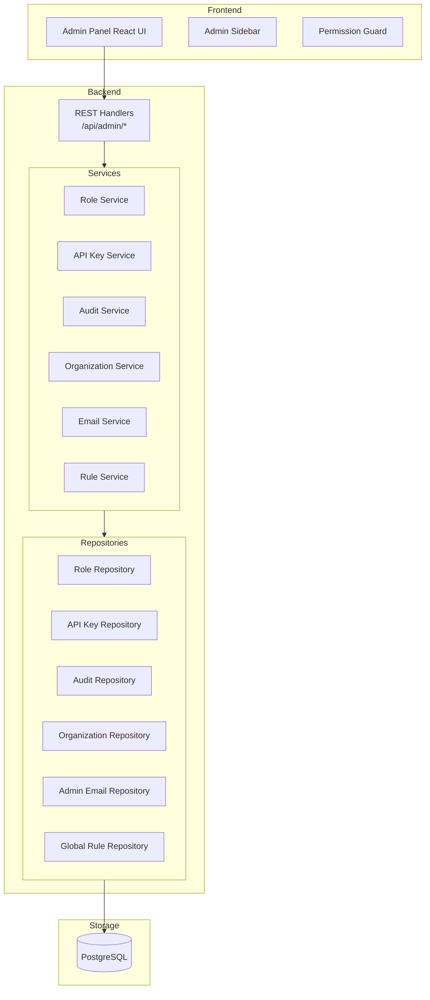

# 000057 - Admin Panel Complete Guide

**Created:** January 4, 2026  
**Status:** Implemented  
**Scope:** Full Admin Panel Documentation (Frontend + Backend)

---

## Overview

The Quantix-vDC Admin Panel provides a comprehensive administrative interface for platform-wide configuration, user management, security settings, and operational controls. It's designed with enterprise features similar to VMware vCenter's administration functionality.

### Key Features

- **Role-Based Access Control (RBAC)** - Granular permission management with custom roles
- **API Key Management** - Programmatic access with scoped permissions
- **Audit Logging** - Complete activity tracking with export capabilities
- **SSO Integration** - OIDC, SAML, and LDAP support
- **Global Rules** - VM creation policies and resource constraints
- **Organization Settings** - Branding, billing, and platform configuration
- **Platform Telemetry** - Resource utilization and growth predictions

---

## Architecture

### System Overview



### Route Structure

| Route | Component | Description |
|-------|-----------|-------------|
| `/admin` | AdminOverview | Dashboard with quick stats |
| `/admin/telemetry` | Telemetry | Resource utilization charts |
| `/admin/certifications` | Certifications | TLS certificate management |
| `/admin/audit-logs` | AuditLogs | Security and activity logs |
| `/admin/emails` | AdminEmails | Notification recipients |
| `/admin/subscriptions` | Subscriptions | Plan and billing info |
| `/admin/roles` | Roles | RBAC management |
| `/admin/sso` | SSOConfig | Single Sign-On settings |
| `/admin/rules` | GlobalRules | VM creation policies |
| `/admin/organization` | Organization | Org settings and branding |
| `/admin/apis` | APIManagement | API key generation |

---

## Access Control

### Permission Requirements

- **Route Guard:** `AdminGuard` component wraps all admin pages
- **Required Role:** `super_admin` or `admin` role
- **JWT Claim:** `role` must be `admin` or have `system:config` permission

### Frontend Guard Component

```typescript
// frontend/src/components/admin/AdminGuard.tsx
export function AdminGuard({ children }: { children: React.ReactNode }) {
  const user = useCurrentUser();
  
  if (!user || user.role !== 'admin') {
    return <AccessDenied />;
  }
  
  return <>{children}</>;
}
```

### Backend Middleware

All `/api/admin/*` endpoints should be protected with the `RequireRole(domain.RoleAdmin)` middleware.

---

## Frontend Components

### File Structure

```
frontend/src/
├── pages/admin/
│   ├── index.tsx           # Main layout with routing
│   ├── AdminOverview.tsx   # Dashboard
│   ├── Telemetry.tsx       # Telemetry charts
│   ├── Certifications.tsx  # Certificate management
│   ├── AuditLogs.tsx       # Audit log viewer
│   ├── AdminEmails.tsx     # Email management
│   ├── Subscriptions.tsx   # Plan information
│   ├── Roles.tsx           # RBAC management
│   ├── SSOConfig.tsx       # SSO settings
│   ├── GlobalRules.tsx     # VM policies
│   ├── Organization.tsx    # Org settings
│   └── APIManagement.tsx   # API keys
└── components/admin/
    ├── index.ts            # Exports
    ├── AdminSidebar.tsx    # Navigation sidebar
    └── AdminGuard.tsx      # Permission check
```

### Admin Sidebar Navigation

The sidebar provides navigation to all admin sections with:
- Active state highlighting
- User info with logout button
- "Back to Dashboard" link
- Warning banner about platform-wide impact

### UI/UX Patterns

| Element | Specification |
|---------|--------------|
| Layout | Full-height sidebar (260px) + scrollable content |
| Max Width | 1280px (7xl container) |
| Cards | 12px rounded corners, floating shadows |
| Animations | Framer Motion scale + opacity |
| Icons | Lucide React icons |
| Colors | Tailwind CSS v4 semantic tokens |

---

## Backend API Reference

### Base URL

```
/api/admin/*
```

All endpoints require authentication with admin privileges.

---

### Roles & Permissions

#### List Roles

```http
GET /api/admin/roles
```

**Query Parameters:**
| Param | Type | Description |
|-------|------|-------------|
| `name` | string | Filter by name (contains) |
| `type` | string | Filter by type (`system` or `custom`) |

**Response:**
```json
[
  {
    "id": "uuid",
    "name": "DevOps Engineer",
    "description": "Custom role for DevOps team",
    "type": "custom",
    "parent_id": null,
    "permissions": ["vm:create", "vm:read", "vm:update"],
    "user_count": 8,
    "created_at": "2026-01-04T10:00:00Z",
    "updated_at": "2026-01-04T10:00:00Z"
  }
]
```

#### Create Role

```http
POST /api/admin/roles
```

**Request Body:**
```json
{
  "name": "DevOps Engineer",
  "description": "Custom role for DevOps team",
  "permissions": ["vm:create", "vm:read", "vm:update", "vm:delete"]
}
```

#### Update Role

```http
PUT /api/admin/roles/{id}
```

**Request Body:**
```json
{
  "name": "DevOps Engineer",
  "description": "Updated description",
  "permissions": ["vm:create", "vm:read", "vm:update", "vm:delete", "node:read"]
}
```

#### Delete Role

```http
DELETE /api/admin/roles/{id}
```

**Note:** System roles cannot be deleted. Roles with assigned users cannot be deleted.

#### List All Permissions

```http
GET /api/admin/permissions
```

**Response:**
```json
[
  "vm:create", "vm:read", "vm:update", "vm:delete",
  "vm:start", "vm:stop", "vm:migrate",
  "node:create", "node:read", "node:update", "node:delete", "node:drain",
  "network:create", "network:read", "network:update", "network:delete",
  "storage:create", "storage:read", "storage:update", "storage:delete",
  "user:create", "user:read", "user:update", "user:delete",
  "system:config", "system:audit"
]
```

#### Assign Role to User

```http
POST /api/admin/users/{userId}/roles
```

**Request Body:**
```json
{
  "role_id": "uuid",
  "assigned_by": "admin-user-id"
}
```

---

### API Keys

#### List API Keys

```http
GET /api/admin/api-keys
```

**Query Parameters:**
| Param | Type | Description |
|-------|------|-------------|
| `created_by` | string | Filter by creator user ID |
| `status` | string | Filter by status (`active`, `expired`, `revoked`) |
| `name` | string | Filter by name (contains) |

**Response:**
```json
[
  {
    "id": "uuid",
    "name": "Production API Key",
    "prefix": "qx_abc123_",
    "permissions": ["vm:read", "vm:start", "vm:stop"],
    "created_by": "user-uuid",
    "created_at": "2026-01-04T10:00:00Z",
    "last_used": "2026-01-04T14:30:00Z",
    "expires_at": "2027-01-04T10:00:00Z",
    "status": "active",
    "usage_count": 1542
  }
]
```

#### Generate API Key

```http
POST /api/admin/api-keys
```

**Request Body:**
```json
{
  "name": "Production API Key",
  "permissions": ["vm:read", "vm:start", "vm:stop"],
  "expires_in_hours": 8760,
  "created_by": "user-uuid"
}
```

**Response:**
```json
{
  "key": { ... },
  "raw_key": "qx_abc123_xxxxxxxxxxxxxxxxxxxxxxxxxxxxxxxxx",
  "warning": "Store this key securely. It will not be shown again."
}
```

⚠️ **Important:** The `raw_key` is only returned once. Store it securely!

#### Revoke API Key

```http
POST /api/admin/api-keys/{id}/revoke
```

#### Delete API Key

```http
DELETE /api/admin/api-keys/{id}
```

---

### Audit Logs

#### Query Audit Logs

```http
GET /api/admin/audit-logs
```

**Query Parameters:**
| Param | Type | Description |
|-------|------|-------------|
| `user_id` | string | Filter by user ID |
| `username` | string | Filter by username (contains) |
| `action` | string | Filter by action type |
| `resource_type` | string | Filter by resource type |
| `resource_id` | string | Filter by resource ID |
| `start_time` | RFC3339 | Start of time range |
| `end_time` | RFC3339 | End of time range |
| `ip_address` | string | Filter by IP address |
| `limit` | int | Max entries (default: 50, max: 1000) |
| `offset` | int | Pagination offset |

**Response:**
```json
{
  "entries": [
    {
      "id": "uuid",
      "user_id": "uuid",
      "username": "john.smith",
      "action": "CREATE",
      "resource_type": "vm",
      "resource_id": "vm-uuid",
      "resource_name": "production-web-01",
      "ip_address": "192.168.1.100",
      "user_agent": "Mozilla/5.0...",
      "details": { "cpu_cores": 4, "memory_mib": 8192 },
      "created_at": "2026-01-04T14:30:00Z"
    }
  ],
  "total": 1542,
  "limit": 50,
  "offset": 0
}
```

#### Export Audit Logs

```http
GET /api/admin/audit-logs/export
```

**Query Parameters:**
| Param | Type | Description |
|-------|------|-------------|
| `format` | string | Export format: `csv` or `json` |
| `start_time` | RFC3339 | Start of time range |
| `end_time` | RFC3339 | End of time range |

**Response:** File download (CSV or JSON)

#### Get Audit Statistics

```http
GET /api/admin/audit-logs/stats
```

**Query Parameters:**
| Param | Type | Description |
|-------|------|-------------|
| `days` | int | Number of days to analyze (default: 7) |

**Response:**
```json
{
  "total_entries": 15420,
  "unique_users": 42,
  "action_counts": {
    "CREATE": 1234,
    "UPDATE": 5678,
    "DELETE": 890,
    "LOGIN": 7618
  },
  "start_time": "2025-12-28T00:00:00Z",
  "end_time": "2026-01-04T23:59:59Z"
}
```

---

### Organization

#### Get Organization

```http
GET /api/admin/organization
```

**Response:**
```json
{
  "id": "uuid",
  "name": "Acme Corporation",
  "domain": "acme.com",
  "settings": {
    "session_timeout_minutes": 60,
    "max_api_keys_per_user": 10,
    "require_mfa": false,
    "allow_self_signup": false,
    "password_min_length": 8,
    "password_require_mix": true,
    "audit_retention_days": 90
  },
  "branding": {
    "logo_url": "https://...",
    "favicon_url": "https://...",
    "primary_color": "#4064DD",
    "secondary_color": "#D974FE",
    "company_name": "Acme Corp",
    "support_email": "support@acme.com"
  },
  "billing_contact": {
    "name": "Jane Doe",
    "email": "billing@acme.com",
    "phone": "+1-555-0100"
  }
}
```

#### Update Organization

```http
PUT /api/admin/organization
```

#### Update Settings Only

```http
PUT /api/admin/organization/settings
```

**Request Body:**
```json
{
  "session_timeout_minutes": 120,
  "require_mfa": true,
  "password_min_length": 12
}
```

#### Update Branding Only

```http
PUT /api/admin/organization/branding
```

**Request Body:**
```json
{
  "primary_color": "#4064DD",
  "company_name": "Acme Corporation",
  "support_email": "support@acme.com"
}
```

---

### Admin Emails

#### List Admin Emails

```http
GET /api/admin/emails
```

**Query Parameters:**
| Param | Type | Description |
|-------|------|-------------|
| `role` | string | Filter by role (`primary`, `secondary`, `billing`, `security`) |
| `verified_only` | bool | Only return verified emails |

**Response:**
```json
[
  {
    "id": "uuid",
    "email": "admin@company.com",
    "name": "John Smith",
    "role": "primary",
    "notifications": {
      "critical_alerts": true,
      "warning_alerts": true,
      "security_events": true,
      "system_updates": false,
      "billing_alerts": true,
      "weekly_reports": false,
      "maintenance_mode": true
    },
    "verified": true,
    "verified_at": "2026-01-01T10:00:00Z",
    "created_at": "2026-01-01T09:00:00Z"
  }
]
```

#### Add Admin Email

```http
POST /api/admin/emails
```

**Request Body:**
```json
{
  "email": "security@company.com",
  "name": "Security Team",
  "role": "security"
}
```

#### Update Admin Email

```http
PUT /api/admin/emails/{id}
```

**Request Body:**
```json
{
  "name": "Updated Name",
  "role": "primary",
  "notifications": {
    "critical_alerts": true,
    "security_events": true
  }
}
```

#### Verify Admin Email

```http
POST /api/admin/emails/{id}/verify
```

#### Send Test Email

```http
POST /api/admin/emails/test
```

**Request Body:**
```json
{
  "id": "admin-email-uuid"
}
```

---

### Global Rules

#### List Global Rules

```http
GET /api/admin/rules
```

**Query Parameters:**
| Param | Type | Description |
|-------|------|-------------|
| `category` | string | Filter by category (`compute`, `storage`, `network`, `security`) |
| `enabled_only` | bool | Only return enabled rules |
| `name` | string | Filter by name (contains) |

**Response:**
```json
[
  {
    "id": "uuid",
    "name": "Max VM CPU Cores",
    "description": "Limit maximum CPU cores per VM to 32",
    "category": "compute",
    "priority": 10,
    "enabled": true,
    "conditions": [
      { "field": "vm.cpu.cores", "operator": "gt", "value": 32 }
    ],
    "actions": [
      { "type": "deny", "message": "VMs cannot have more than 32 CPU cores" }
    ],
    "created_at": "2026-01-01T10:00:00Z"
  }
]
```

#### Create Global Rule

```http
POST /api/admin/rules
```

**Request Body:**
```json
{
  "name": "Max VM Memory",
  "description": "Limit maximum memory per VM to 256GB",
  "category": "compute",
  "priority": 10,
  "conditions": [
    { "field": "vm.memory.size_mib", "operator": "gt", "value": 262144 }
  ],
  "actions": [
    { "type": "deny", "message": "VMs cannot have more than 256GB RAM" }
  ]
}
```

#### Update Global Rule

```http
PUT /api/admin/rules/{id}
```

#### Delete Global Rule

```http
DELETE /api/admin/rules/{id}
```

#### Enable/Disable Rule

```http
POST /api/admin/rules/{id}/enable
POST /api/admin/rules/{id}/disable
```

#### Evaluate Rules

```http
POST /api/admin/rules/evaluate
```

**Request Body:**
```json
{
  "category": "compute",
  "context": {
    "vm.cpu.cores": 64,
    "vm.memory.size_mib": 131072
  }
}
```

**Response:**
```json
[
  {
    "rule_id": "uuid",
    "rule_name": "Max VM CPU Cores",
    "category": "compute",
    "matched": true,
    "blocked": true,
    "message": "VMs cannot have more than 32 CPU cores"
  }
]
```

---

## Database Schema

### Tables

```sql
-- Custom Roles
CREATE TABLE roles (
    id UUID PRIMARY KEY,
    name VARCHAR(100) UNIQUE NOT NULL,
    description TEXT,
    type VARCHAR(20) DEFAULT 'custom',
    parent_id UUID REFERENCES roles(id),
    permissions JSONB DEFAULT '[]',
    created_at TIMESTAMPTZ DEFAULT NOW(),
    updated_at TIMESTAMPTZ DEFAULT NOW()
);

-- API Keys
CREATE TABLE api_keys (
    id UUID PRIMARY KEY,
    name VARCHAR(100) NOT NULL,
    prefix VARCHAR(20) NOT NULL,
    key_hash VARCHAR(255) NOT NULL,
    permissions JSONB DEFAULT '[]',
    created_by UUID REFERENCES users(id),
    expires_at TIMESTAMPTZ,
    status VARCHAR(20) DEFAULT 'active',
    usage_count BIGINT DEFAULT 0,
    last_used TIMESTAMPTZ,
    created_at TIMESTAMPTZ DEFAULT NOW()
);

-- SSO Configuration
CREATE TABLE sso_configs (
    id UUID PRIMARY KEY,
    provider_type VARCHAR(20) NOT NULL,
    name VARCHAR(100) NOT NULL,
    enabled BOOLEAN DEFAULT FALSE,
    config JSONB NOT NULL DEFAULT '{}',
    auto_provision BOOLEAN DEFAULT FALSE,
    default_role VARCHAR(50) DEFAULT 'viewer',
    group_mapping JSONB DEFAULT '{}',
    created_at TIMESTAMPTZ DEFAULT NOW()
);

-- Organizations
CREATE TABLE organizations (
    id UUID PRIMARY KEY,
    name VARCHAR(255) NOT NULL,
    domain VARCHAR(255),
    settings JSONB DEFAULT '{}',
    branding JSONB DEFAULT '{}',
    billing_contact JSONB DEFAULT '{}',
    created_at TIMESTAMPTZ DEFAULT NOW()
);

-- Admin Emails
CREATE TABLE admin_emails (
    id UUID PRIMARY KEY,
    email VARCHAR(255) UNIQUE NOT NULL,
    name VARCHAR(255),
    role VARCHAR(20) DEFAULT 'secondary',
    notifications JSONB DEFAULT '{}',
    verified BOOLEAN DEFAULT FALSE,
    created_at TIMESTAMPTZ DEFAULT NOW()
);

-- Global Rules
CREATE TABLE global_rules (
    id UUID PRIMARY KEY,
    name VARCHAR(255) NOT NULL,
    description TEXT,
    category VARCHAR(50) NOT NULL,
    priority INT DEFAULT 100,
    enabled BOOLEAN DEFAULT TRUE,
    conditions JSONB NOT NULL DEFAULT '[]',
    actions JSONB NOT NULL DEFAULT '[]',
    created_at TIMESTAMPTZ DEFAULT NOW()
);

-- User Role Assignment
CREATE TABLE user_roles (
    user_id UUID REFERENCES users(id) ON DELETE CASCADE,
    role_id UUID REFERENCES roles(id) ON DELETE CASCADE,
    assigned_at TIMESTAMPTZ DEFAULT NOW(),
    assigned_by UUID REFERENCES users(id),
    PRIMARY KEY (user_id, role_id)
);
```

### Migration

Apply the migration:

```bash
cd backend
migrate -path migrations -database "postgres://..." up
```

---

## Security Considerations

### API Key Security

1. **Hashing:** Keys are hashed with bcrypt before storage
2. **One-time Display:** Raw keys shown only once at creation
3. **Prefix Lookup:** Keys identified by prefix for quick validation
4. **Expiration:** Support for automatic expiry
5. **Revocation:** Immediate revocation capability

### Audit Logging

1. **Immutable:** No UPDATE/DELETE on audit_log table
2. **Retention:** Configurable retention period (default: 90 days)
3. **IP Tracking:** Client IP recorded for all actions
4. **User Agent:** Browser/client info logged

### SSO Security

1. **PKCE Support:** OIDC with PKCE for additional security
2. **TLS Required:** All SSO connections require TLS
3. **Secret Encryption:** Secrets encrypted at rest
4. **LDAP Warning:** Legacy protocol disabled by default

---

## Frontend Integration

### Connecting to Backend

Update the frontend hooks to use real API calls:

```typescript
// frontend/src/hooks/useAdmin.ts
import { useQuery, useMutation, useQueryClient } from '@tanstack/react-query';
import { apiClient } from '@/lib/api-client';

export function useRoles() {
  return useQuery({
    queryKey: ['admin', 'roles'],
    queryFn: () => apiClient.get('/api/admin/roles'),
  });
}

export function useCreateRole() {
  const queryClient = useQueryClient();
  
  return useMutation({
    mutationFn: (data: CreateRoleRequest) => 
      apiClient.post('/api/admin/roles', data),
    onSuccess: () => {
      queryClient.invalidateQueries({ queryKey: ['admin', 'roles'] });
    },
  });
}

export function useAuditLogs(filters: AuditFilter) {
  return useQuery({
    queryKey: ['admin', 'audit-logs', filters],
    queryFn: () => apiClient.get('/api/admin/audit-logs', { params: filters }),
  });
}

// ... etc for each admin section
```

---

## Future Enhancements

### Phase 2

- [ ] SSO Service: OIDC callback handling with token exchange
- [ ] SAML Service: SP metadata and assertion validation
- [ ] Auth Middleware: JWT validation for admin routes
- [ ] Real-time Updates: WebSocket for live telemetry

### Phase 3

- [ ] Role Inheritance Visualization: Tree diagram UI
- [ ] Bulk Operations: Import/export users and roles
- [ ] Advanced Analytics: Usage patterns, cost analysis
- [ ] Compliance Reports: SOC2, ISO27001 exports
- [ ] Webhook Integration: External notification services

---

## Related Documentation

- [000026 - Admin Panel Implementation (Frontend)](./000026-admin-panel-implementation.md)
- [000027 - Error Handling Patterns](./000027-error-handling-patterns.md)
- [000024 - Backend Implementation Guide](../Backend/000024-backend-implementation-guide.md)
- [ADR 000005 - gRPC Services Design](../adr/000005-grpc-services-design.md)
