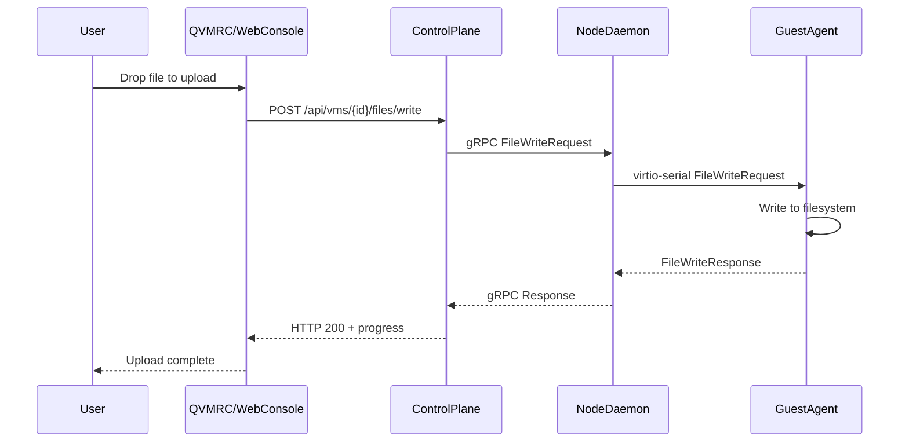

# Workflow State: Clean

No active workflows.

---

## Completed: Console Performance, File Transfer & VM Sidebar (January 4, 2026)

Successfully implemented the console improvements plan covering:
1. VNC encoding optimizations (Tight/ZRLE) for QVMRC
2. VM Sidebar for Console Dock quick navigation
3. File transfer between host and VM guests

### Summary

#### Phase 1: QVMRC VNC Performance (Tight/ZRLE Encodings)

Added support for high-performance VNC encodings:

**Files Modified:**
- `qvmrc/src-tauri/src/vnc/encodings.rs` - Added `decode_tight()` and `decode_zrle()` functions
- `qvmrc/src-tauri/src/vnc/rfb.rs` - Integrated encodings, added `TightZlibState`, reordered encoding priority

**Key Features:**
- **ZRLE Decoder**: 64x64 tile-based with Raw, Solid, PackedPalette, PlainRLE, PaletteRLE subencodings
- **Tight Decoder**: FillCompression, JpegCompression, BasicCompression with Copy/Palette/Gradient filters
- **Persistent Zlib Streams**: Maintains 4 zlib streams per Tight spec for better compression
- **Encoding Priority**: ZRLE > Tight > Hextile > Zlib > RRE > CopyRect > Raw

#### Phase 2: VM Sidebar for Console Dock

Created a collapsible VM sidebar for quick console navigation:

**Files Created:**
- `frontend/src/components/console/VMSidebar.tsx`

**Files Modified:**
- `frontend/src/hooks/useConsoleStore.ts` - Added `sidebarCollapsed` state
- `frontend/src/pages/ConsoleDock.tsx` - Integrated sidebar layout
- `frontend/src/components/console/index.ts` - Added export

**Features:**
- Search/filter VMs by name or ID
- Status indicators (running/stopped)
- "Open" badge for VMs with active console sessions
- Keyboard navigation (arrow keys + Enter)
- Collapsible to icon-only mode (persisted)

#### Phase 3: Backend File Transfer Endpoints

Added REST API for guest agent file operations:

**Files Created:**
- `backend/internal/server/file_transfer.go`

**Files Modified:**
- `backend/internal/server/vm_rest.go` - Routes file transfer requests
- `backend/internal/server/server.go` - Updated route registration

**API Endpoints:**
```
POST   /api/vms/{id}/files/write   - Write file to guest
POST   /api/vms/{id}/files/read    - Read file from guest
GET    /api/vms/{id}/files/list    - List directory in guest
GET    /api/vms/{id}/files/stat    - Get file metadata
DELETE /api/vms/{id}/files/delete  - Delete file in guest
```

#### Phase 4: QVMRC File Transfer Module

Created native file transfer for the Tauri desktop client:

**Files Created:**
- `qvmrc/src-tauri/src/filetransfer/mod.rs` - Module exports and types
- `qvmrc/src-tauri/src/filetransfer/upload.rs` - Upload implementation
- `qvmrc/src-tauri/src/filetransfer/download.rs` - Download implementation
- `qvmrc/src-tauri/src/filetransfer/progress.rs` - Progress tracking

**Files Modified:**
- `qvmrc/src-tauri/src/main.rs` - Registered file transfer commands

**Tauri Commands:**
- `upload_file_to_vm` - Upload single file with progress
- `upload_files_to_vm` - Upload multiple files
- `download_file_from_vm` - Download file with progress
- `list_files_in_vm` - Directory listing
- `stat_file_in_vm` - File metadata
- `delete_file_in_vm` - Delete file

#### Phase 5: Web Console File Transfer UI

Created React components and hooks for browser-based file transfer:

**Files Created:**
- `frontend/src/hooks/useFileTransfer.ts` - React Query hooks
- `frontend/src/components/console/FileTransferPanel.tsx` - File browser UI

**Features:**
- File browser with navigation
- Drag-and-drop upload
- Download files to host
- Create/delete files
- Upload progress tracking
- Breadcrumb navigation

---

## Architecture



---

## Files Summary

### Created (12 files)
- `frontend/src/components/console/VMSidebar.tsx`
- `frontend/src/components/console/FileTransferPanel.tsx`
- `frontend/src/hooks/useFileTransfer.ts`
- `backend/internal/server/file_transfer.go`
- `qvmrc/src-tauri/src/filetransfer/mod.rs`
- `qvmrc/src-tauri/src/filetransfer/upload.rs`
- `qvmrc/src-tauri/src/filetransfer/download.rs`
- `qvmrc/src-tauri/src/filetransfer/progress.rs`

### Modified (9 files)
- `qvmrc/src-tauri/src/vnc/encodings.rs`
- `qvmrc/src-tauri/src/vnc/rfb.rs`
- `qvmrc/src-tauri/src/main.rs`
- `frontend/src/pages/ConsoleDock.tsx`
- `frontend/src/hooks/useConsoleStore.ts`
- `frontend/src/components/console/index.ts`
- `backend/internal/server/vm_rest.go`
- `backend/internal/server/server.go`
